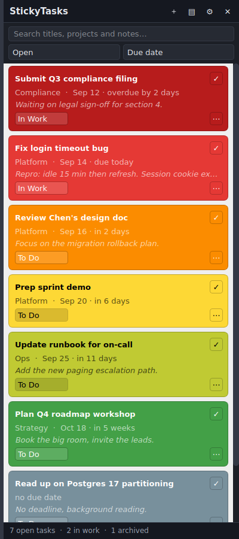

# StickyTasks

A task panel that docks to one edge of a monitor and stays there, like MS Sticky
Notes but organised around due dates. Each task is a card whose background
colour tells you how urgent it is: red for overdue, green for far off. Tasks
carry a project, a status, and a rich-text note you can paste screenshots into.
Completed tasks are archived rather than deleted, so at review time you can
generate a report of everything you finished in a date range.



## What it does

- **Docks to a screen edge.** Pick the monitor and the left or right edge; the
  panel fills that edge from the top of the work area to the bottom.
- **Starts with Windows if you want it to.** One checkbox in Settings, no
  installer.
- **Colours tasks by due date.** Six bands by default (overdue → red, more than
  two weeks out → green). Every threshold and colour is editable.
- **Rich-text notes with images.** Bold, italic, underline, strikethrough,
  bullet and numbered lists, text colour, highlight. Paste an image straight
  from the clipboard with Ctrl+V, or drag an image file onto the note.
- **Three statuses:** To Do, In Work, Complete.
- **Completing archives, it does not delete.** A completed task leaves the panel
  but stays in the database forever. The only thing that removes a task is the
  explicit "Delete permanently" menu item.
- **Review reports.** Pick a date range and get Markdown or plain text listing
  what you completed, grouped by project, with your notes included.
- **Full history.** Every status change is timestamped, so a report can show
  when work started, not just that it finished.

## Requirements

- Python 3.9 or newer (developed and tested on 3.11)
- PySide6 (the official Qt 6 binding for Python)

## Install and run

```
pip install -r requirements.txt
python run_stickytasks.py
```

On Windows, double-clicking **StickyTasks.bat** launches it without a console
window.

To have the panel there every time you sign in, tick **Start StickyTasks when I
sign in to Windows** in Settings → Placement. That writes a single value under
your own account's Run key: nothing is installed, and nobody else who uses the PC
is affected. It appears in Task Manager's Startup tab, and turning it off there
turns the checkbox off too. The entry records the interpreter and script path as
they are when you tick the box, so untick and re-tick it if you move this folder.

If a policy on a managed machine refuses that write, the manual route still
works: press `Win+R`, run `shell:startup`, and put a shortcut to the .bat file in
the folder that opens.

## Where your data lives

Everything sits in one folder, so backing up means copying one directory:

| OS      | Location                                  |
| ------- | ----------------------------------------- |
| Windows | `%APPDATA%\StickyTasks`                   |
| macOS   | `~/Library/Application Support/StickyTasks` |
| Linux   | `~/.local/share/stickytasks`              |

Inside it:

- `stickytasks.db` — SQLite database with every task, note and status change
- `settings.json` — your settings, human-readable and hand-editable
- `images/` — images pasted into notes, stored once each no matter how many
  notes use them
- `exports/` — the default folder offered when you save a report

Set the `STICKYTASKS_HOME` environment variable to put all of it somewhere else
(a synced folder, for example).

## Due-date colours

A task takes the colour of the first band its due date fits into, counting days
from today. The defaults:

| Band          | Days until due | Colour    |
| ------------- | -------------- | --------- |
| Overdue       | ≤ -1           | `#b71c1c` |
| Due today     | ≤ 0            | `#e53935` |
| Next 3 days   | ≤ 3            | `#fb8c00` |
| This week     | ≤ 7            | `#fdd835` |
| Next 2 weeks  | ≤ 14           | `#c0ca33` |
| Later         | no limit       | `#43a047` |

Edit them under **Settings → Due-date colours**: change a threshold, change a
colour, add a band, remove one. Exactly one band must be marked "no limit" —
it catches everything further out. If you delete it by accident, the app puts
one back rather than leaving distant tasks uncoloured.

Tasks with no due date get their own neutral colour, as do completed tasks.
Card text switches between black and white automatically based on how light the
background is, so a yellow band stays readable.

Colours are relative to today, so the panel re-colours itself when the date
rolls over while it is running.

## Reports

Open with the ▤ button or Ctrl+R. Pick a preset period (this year, last 12
months, this quarter, last calendar year) or set your own dates, then choose:

- **Scope** — only tasks completed in the period, or everything you touched
  (created, worked on, or completed).
- **Format** — Markdown or plain text.
- **Contents** — include note text, include status history, group by project,
  and optionally trim long notes to a character limit.

The preview updates as you change the options. Copy it to the clipboard or save
it to a file.

## Keyboard shortcuts

| Shortcut       | Action                                  |
| -------------- | --------------------------------------- |
| `Ctrl+N`       | New task                                |
| `Ctrl+F`       | Focus the search box                    |
| `Ctrl+R`       | Open the report window                  |
| `F5`           | Refresh                                 |
| `Esc`          | Clear the search, or hide to the tray    |
| `Ctrl+B/I/U`   | Bold / italic / underline in a note      |
| `Ctrl+Enter`   | Save and close the task editor           |

Double-click a card to open it. Right-click one, or use its ⋯ button, for
duplicate, hide, and delete.

Drag the panel's title bar and let go over another monitor to move it there; it
snaps to whichever half of that screen you released it over, and remembers the
choice. Drag the thin strip along the panel's inner edge to resize it.

## About "reserving" screen space

By default the panel floats above other windows. A maximised window will slide
underneath it rather than stopping at its edge — this is also how MS Sticky
Notes behaves.

Settings → Placement has a **Reserve screen space** option that registers the
panel as a Windows AppBar, which makes maximised windows stop at the panel's
edge the way the taskbar does. Two honest caveats:

1. It is Windows-only. The option is disabled on macOS and Linux, where no
   equivalent API exists.
2. **It is untested.** This project was developed on Linux, where the AppBar
   code path cannot run at all. The implementation follows the documented
   `SHAppBarMessage` contract and fails safe — if registration fails the panel
   just floats, as it does with the option off — but nobody has yet watched it
   work on a real Windows desktop. Treat it as the one experimental feature
   here and leave it off if the panel misbehaves.

Everything else in the app is covered by the automated tests described below.

## Picking this up in a new session

`CLAUDE.md` is read automatically by Claude Code whenever it starts in this
folder: how to run and test, the architecture, and the rules that matter.
`docs/HANDOFF.md` records why the design is the way it is, what is verified and
what is not, and what to try first on a real Windows desktop.

## Running the tests

```
pip install pytest
python -m pytest
```

123 tests covering the colour bands, the database and its archive rules, report
generation, settings validation, the image store, and the widgets themselves.
The UI tests drive real Qt widgets under Qt's offscreen platform, so they need
no display.

## How it is put together

```
stickytasks/
  colors.py       due date → colour band, and contrast-aware text colour
  config.py       settings, loaded and saved as JSON with validation
  db.py           SQLite storage, schema migrations, status history
  humanize.py     "overdue by 3 days", "in 2 weeks"
  imagestore.py   content-addressed image files for note attachments
  models.py       Task and StatusEvent
  report.py       Markdown and plain-text report generation
  paths.py        where the data folder lives on each OS
  app.py          startup
  ui/
    panel.py            the docked panel
    taskcard.py         one colour-coded task card
    editor.py           the task editor dialog
    richtext.py         note editor, clipboard image handling
    settings_dialog.py  settings, including the colour band editor
    report_dialog.py    report builder
    theme.py            stylesheet for the panel chrome
    icons.py            icons drawn at runtime — no binary assets
    elidedlabel.py      labels that shrink instead of widening the panel
    winappbar.py        optional Windows AppBar support
```

The layers are separate on purpose: nothing under `stickytasks/` outside `ui/`
imports Qt, which is why the storage, colour and reporting logic can be tested
directly.

## Deliberate limitations

Things this does not do, so there are no surprises:

- **No reminders or notifications.** Colour is the only nudge.
- **No recurring tasks.** Use Duplicate.
- **No sync or multi-device support.** One SQLite file on one machine. Pointing
  `STICKYTASKS_HOME` at a synced folder will work for one machine at a time, but
  two machines editing at once will conflict.
- **No sub-tasks, tags, priorities, or attachments other than images.**
- **No global hotkey** to summon the panel — Qt has no cross-platform API for
  one. Use the tray icon.
- **Notes are stored as HTML** produced by Qt's text engine. It is readable and
  the reports flatten it to plain text, but it is not Markdown.
